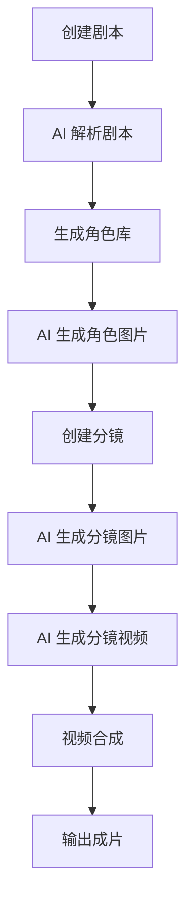

# Huobao Drama 项目架构文档

## 概述

Huobao Drama 是一个基于 **Go + Vue3** 的全栈 AI 短剧自动化生产平台，采用 **DDD（领域驱动设计）** 架构模式，实现从剧本生成、角色设计、分镜制作到视频合成的全流程自动化。

---

## 技术栈

| 类型 | 技术 |
|------|------|
| **后端** | Go 1.23+, Gin, GORM, SQLite |
| **前端** | Vue 3.4+, TypeScript 5+, Vite 5, Element Plus, TailwindCSS, Pinia |
| **视频处理** | FFmpeg |
| **AI 服务** | OpenAI, Gemini, 火山（豆包）, MiniMax 等 |

---

## 目录结构

```
huobao-drama/
├── main.go                 # 应用入口
├── go.mod / go.sum         # Go 依赖管理
├── docker-compose.yml      # Docker 编排配置
├── Dockerfile              # Docker 镜像构建
├── configs/                # 配置文件
├── api/                    # API 层（HTTP 接口）
├── application/            # 应用服务层（业务逻辑）
├── domain/                 # 领域层（数据模型）
├── infrastructure/         # 基础设施层
├── pkg/                    # 公共工具包
├── web/                    # 前端代码
├── migrations/             # 数据库迁移脚本
├── data/                   # 运行时数据存储
└── docs/                   # 项目文档
```

---

## 核心分层架构

### 1. API 层 (`api/`)

负责 HTTP 请求处理、参数验证、响应封装。

```
api/
├── handlers/               # 请求处理器
│   ├── drama.go            # 剧本相关接口
│   ├── character_library.go # 角色库接口
│   ├── storyboard.go       # 分镜接口
│   ├── image_generation.go # 图片生成接口
│   ├── video_generation.go # 视频生成接口
│   ├── video_merge.go      # 视频合成接口
│   ├── scene.go            # 场景管理接口
│   ├── asset.go            # 素材管理接口
│   ├── ai_config.go        # AI 配置接口
│   ├── settings.go         # 系统设置接口
│   ├── task.go             # 任务管理接口
│   ├── upload.go           # 文件上传接口
│   └── ...                 # 其他处理器
├── middlewares/            # 中间件
│   └── cors.go, logger.go  # CORS、日志等
└── routes/                 # 路由定义
    └── routes.go           # 路由注册
```

---

### 2. 应用服务层 (`application/services/`)

封装核心业务逻辑，协调领域对象，调用外部服务。

| 文件 | 功能说明 |
|------|----------|
| `drama_service.go` | 剧本创建、编辑、解析 |
| `character_library_service.go` | 角色库管理、AI 角色生成 |
| `storyboard_service.go` | 分镜管理、自动分镜生成 |
| `storyboard_composition_service.go` | 分镜合成与编排 |
| `image_generation_service.go` | AI 图片生成（文生图） |
| `video_generation_service.go` | AI 视频生成（图生视频） |
| `video_merge_service.go` | 视频合成、剪辑、转场 |
| `frame_prompt_service.go` | 分镜提示词管理 |
| `script_generation_service.go` | AI 剧本生成 |
| `ai_service.go` | AI 服务调用封装 |
| `asset_service.go` | 素材库管理 |
| `prop_service.go` | 道具管理 |
| `task_service.go` | 异步任务管理 |
| `upload_service.go` | 文件上传处理 |
| `data_migration_service.go` | 数据迁移 |
| `prompt_i18n.go` | 提示词国际化 |

---

### 3. 领域层 (`domain/models/`)

定义核心数据模型和领域实体。

| 文件 | 模型说明 |
|------|----------|
| `drama.go` | **剧本模型**：包含章节、场景、角色关联 |
| `character_library.go` | **角色模型**：角色形象、描述、图片 |
| `timeline.go` | **分镜时间线**：分镜序列、时长、帧类型 |
| `image_generation.go` | **图片生成任务**：生成状态、参数、结果 |
| `video_generation.go` | **视频生成任务**：生成状态、参数、结果 |
| `video_merge.go` | **视频合成任务**：合成配置、输出路径 |
| `asset.go` | **素材模型**：图片/视频素材信息 |
| `ai_config.go` | **AI 配置模型**：服务商、API Key、模型配置 |
| `task.go` | **任务模型**：异步任务状态追踪 |
| `frame_prompt.go` | **分镜提示词**：用于 AI 图片生成的提示词 |

---

### 4. 基础设施层 (`infrastructure/`)

提供外部服务集成和技术实现。

```
infrastructure/
├── database/               # 数据库连接与迁移
│   ├── database.go         # 数据库初始化（SQLite/MySQL/PostgreSQL）
│   └── migrate.go          # GORM 自动迁移
├── storage/                # 文件存储
│   └── local_storage.go    # 本地文件存储实现
├── scheduler/              # 任务调度
│   └── scheduler.go        # 定时任务管理
└── external/               # 外部服务集成
    └── http_client.go      # HTTP 客户端
```

---

### 5. 公共工具包 (`pkg/`)

提供通用工具和 AI 服务客户端。

```
pkg/
├── config/                 # 配置加载
│   └── config.go           # Viper 配置读取
├── logger/                 # 日志组件
│   └── logger.go           # Zap 日志封装
├── response/               # HTTP 响应封装
│   └── response.go         # 统一响应格式
├── utils/                  # 通用工具
│   ├── uuid.go             # UUID 生成
│   ├── retry.go            # 重试机制
│   └── http_helper.go      # HTTP 工具函数
├── ai/                     # AI 服务客户端
│   ├── client.go           # AI 客户端接口
│   ├── openai_client.go    # OpenAI 客户端（文本/图片）
│   └── gemini_client.go    # Gemini 客户端
├── image/                  # 图片处理
│   ├── processor.go        # 图片处理工具
│   ├── grid.go             # 九宫格拼接
│   └── crop.go             # 图片裁剪
└── video/                  # 视频处理
    ├── video_client.go     # 视频 API 客户端接口
    ├── chatfire_client.go  # Chatfire 视频服务
    ├── volces_ark_client.go # 火山方舟客户端
    ├── minimax_client.go   # MiniMax 客户端
    └── openai_sora_client.go # OpenAI Sora 客户端
```

---

## 前端架构 (`web/`)

采用 Vue 3 + TypeScript + Vite 构建。

```
web/
├── index.html              # 入口 HTML
├── package.json            # 依赖配置
├── vite.config.ts          # Vite 配置
├── tailwind.config.js      # TailwindCSS 配置
├── tsconfig.json           # TypeScript 配置
├── nginx.conf              # Nginx 配置（生产部署）
├── public/                 # 静态资源
└── src/
    ├── main.ts             # 应用入口
    ├── App.vue             # 根组件
    ├── api/                # API 调用模块
    ├── assets/             # 静态资源
    ├── components/         # 公共组件
    ├── views/              # 页面视图
    ├── router/             # 路由配置
    ├── stores/             # Pinia 状态管理
    ├── types/              # TypeScript 类型定义
    ├── utils/              # 工具函数
    └── locales/            # 国际化文件
```

---

## 配置文件说明

### `configs/config.yaml`

主配置文件，包含：
- **app**: 应用名称、版本、调试模式
- **server**: 端口、CORS、超时配置
- **database**: 数据库类型和连接参数
- **storage**: 存储类型和路径
- **ai**: 默认 AI 服务提供商

### `.env.example`

Docker 构建环境变量模板，包含镜像源加速配置。

---

## 数据库

### 类型
默认使用 **SQLite**，支持 MySQL 和 PostgreSQL。

### 迁移脚本 (`migrations/`)

| 文件 | 说明 |
|------|------|
| `init.sql` | 初始表结构定义 |
| `20260126_add_local_path.sql` | 添加本地路径字段 |

> 注：GORM AutoMigrate 会在启动时自动同步表结构。

---

## 工作流程



---

## 部署文件

| 文件 | 说明 |
|------|------|
| `Dockerfile` | 多阶段构建，包含前端编译和后端编译 |
| `docker-compose.yml` | 容器编排配置 |
| `.dockerignore` | Docker 构建忽略规则 |
| `DOCKER_HOST_ACCESS.md` | Docker 访问宿主机服务指南 |

---

## 文档说明

| 文件 | 说明 |
|------|------|
| `README.md` | 英文说明文档 |
| `README-CN.md` | 中文说明文档（主文档） |
| `README-JA.md` | 日文说明文档 |
| `MIGRATE_README.md` | 数据迁移指南 |
| `docs/DATA_MIGRATION.md` | 详细数据迁移文档 |
| `LICENSE` | CC BY-NC-SA 4.0 许可证 |

---

## 入口文件说明

### `main.go`

应用主入口，执行流程：
1. 加载配置文件
2. 初始化日志
3. 连接数据库
4. 执行数据库迁移
5. 初始化本地存储
6. 设置路由
7. 启动 HTTP 服务器
8. 监听信号优雅关闭

---

## 快速参考

| 需求 | 查看位置 |
|------|----------|
| 添加新 API 接口 | `api/handlers/` + `api/routes/routes.go` |
| 添加业务逻辑 | `application/services/` |
| 修改数据模型 | `domain/models/` |
| 配置 AI 服务 | `pkg/ai/` + `pkg/video/` |
| 前端页面 | `web/src/views/` |
| 前端组件 | `web/src/components/` |
| API 调用封装 | `web/src/api/` |
| 配置修改 | `configs/config.yaml` |
